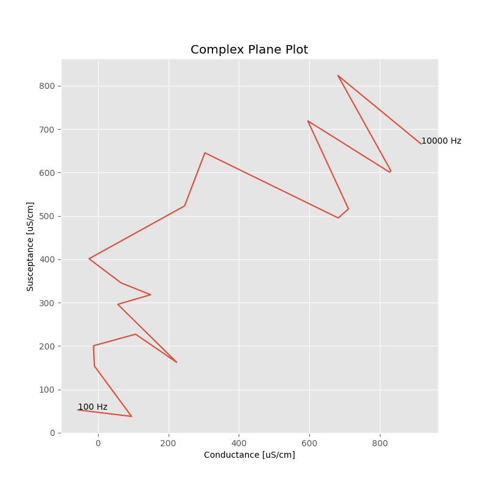
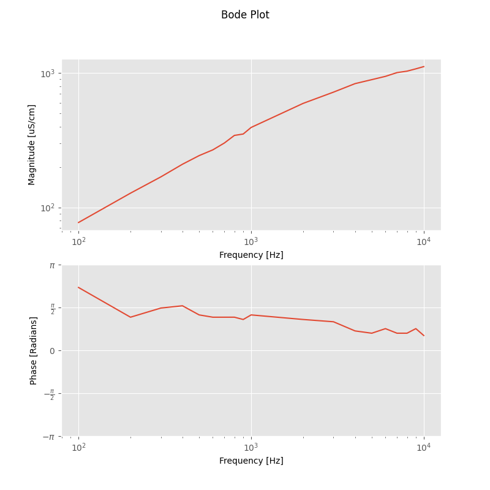

# Caltech Nanofab Water Sensor

The code on this repository can be used to build a .uf2 file that can be burned
onto a Raspberry Pi Pico.
In conjuction with the [circuit board](./eagle), this code can measure the following
properties of a liquid (typically water) sample:
* conductivity
* temperature
* pressure

The details are outlined in [Matt Muldowney's Caltech Senior Thesis.](https://drive.google.com/file/d/1CX-nBUIhEnU6BN1XVLlp9IrTPnzySD1C/view?usp=sharing)

## Installation

### Quick Installation

Download the setup script located at [./setup/setup.sh](./setup/setup.sh).
In whatever directory you downloaded it, run it as

```
$ ./setup.sh
```

Make sure the script is executable before you do this.

Note that this script clones this repo to ~/total.

### Manual Installation

["Getting started with the Raspberry Pi Pico](https://datasheets.raspberrypi.com/pico/getting-started-with-pico.pdf)
provides a comprehensive set of installation instructions on any operating system.
Follow these instructions to install the Rapsberry Pi Pico C/C++ SDK along with other tools.

Once this is done, follow these instructions:
1. Clone this repository:
```
$ git clone https://github.com/mmuldo/total
```
2. Change directory to the total/setup directory:
```
$ cd total/setup
```
3. Copy the bashrc in this repository to ~/.bashrc:
```
$ cp .bashrc ~/.bashrc
```
4. Install the necessary python packages:
```
$ pip install -r requirements.txt
```

If you haven't already, restart your system.

## Quickstart

Measurements are taken by running the CLI. This is done at the root of this repository (your total directory):

```
$ python3 src/ui/cli.py --help
```

### Getting Help

Every command in the CLI along with the CLI itself has a detailed help menu associated with it.
These help menus walk you through every argument and every flag that can be passed to a command.

Here are some examples:
```
$ python3 src/ui/cli.py --help
Usage: cli.py [OPTIONS] COMMAND [ARGS]...

  CLI for running water sensor measurements.

Options:
  --install-completion [bash|zsh|fish|powershell|pwsh]
                                  Install completion for the specified shell.
  --show-completion [bash|zsh|fish|powershell|pwsh]
                                  Show completion for the specified shell, to
                                  copy it or customize the installation.
  --help                          Show this message and exit.

Commands:
  envirostats       Gets temperature and pressure measurments.
  single            Gets admittance measurement at a single frequency.
  sweep             Gets admittance measurement over a range of frequencies.
  sweep-from-files  Processes existing admittance data over a range of...
```
```
$ python3 src/ui/cli.py sweep --help
Usage: cli.py sweep [OPTIONS]

  Gets admittance measurement over a range of frequencies.

Options:
  --amplitude FLOAT               amplitude of sinusoid (between 0.1 and 1.0
                                  V)  [default: 0.7]
  --show-plots / --no-show-plots  presents bode plot immediately  [default:
                                  no-show-plots]
  --bode-plot-file TEXT           png file to save bode plot
  --complex-plot-file TEXT        png file to save complex plane plot
  --magnitude-file TEXT           csv file to save admittance magnitudes
  --phase-file TEXT               csv file to save admittance phases
  --include-envirostats / --no-include-envirostats
                                  also get temperature and pressure
                                  measurements  [default: include-envirostats]
  --envirostats-file TEXT         csv file to save temperature and pressure
                                  data
  --conversion-factor FLOAT       if set, converts all admittance quantities
                                  from S to uS/cm using this factor
  --help                          Show this message and exit.
```

### Temperature and Pressure

To retrieve temperature and pressure measurements on their own and save the data to data/envirostats.csv:
```
$ python3 src/ui/cli.py envirostats --output-file data/envirostats.csv
Temperature: 20.857 C
Pressure: 976.858 mBars
```
**data/envirostats.csv**
|Temperature (C)|Pressure (mBars)|
|---------------|----------------|
|20.857|976.858|

To measure temperature and pressure in addition to a conductivity measurement at a single frequency of 3kHz and save data to data/3kHz.csv:
```
$ python3 src/ui/cli.py single 3000 --include-envirostats --output-file data/3kHz.csv
Admittance: 3.95E-05 + j4.78E-05 S
Temperature: 20.788 C
Pressure: 972.484 mBars
```
**data/3kHz.csv**
|Frequency (Hz)|	Conductance (S)|	Susceptance (S)|	Temperature (C)|	Pressure (mBars)|
|----|----|---|-----|-----|
|3000	|3.95438956603354E-05|	4.78003585796092E-05	|20.788	|972.484|


To measure temperature and pressure in addition to a conductivity measurement at a sweep of frequencies and save temperature and pressure data to data/envirostats.csv:
```
$ python3 src/ui/cli.py sweep --include-envirostats --envirostats-file data/envirostats.csv
    Frequency (Hz)  Magnitude (S)  Phase (Radians)
0              100       0.000010         1.382185
1              200       0.000013         1.131185
2              300       0.000017         1.131185
3              400       0.000019         1.633185
4              500       0.000023         1.131000
5              600       0.000027         1.131185
6              700       0.000028         1.131185
7              800       0.000032         0.879185
8              900       0.000035         1.131185
9             1000       0.000035         0.879185
10            2000       0.000053         0.879185
11            3000       0.000062         0.628185
12            4000       0.000071         0.879185
13            5000       0.000076         0.879185
14            6000       0.000081         0.628185
15            7000       0.000085         0.880000
16            8000       0.000089         0.879185
17            9000       0.000092         0.628185
18           10000       0.000095         0.628185
Temperature: 20.889 C
Pressure: 979.044 mBars
```
**data/envirostats.csv**
|Temperature (C)|	Pressure (mBars)|
|----|-----|
|20.857	|976.858|
|20.889	|979.044|
Note that, in this case, because we have already output data to this file, the new data is appended.


Note that, by default, envirostats are included, so there is no need to pass `--include-envirostats`; we just do it here for clarity.
If you want to exclude envirostats measurement, pass the `--no-include-envirostats` flag.

### Conductivity

#### Single Frequency

To measure the conductivity at a single frequency of 9kHz, amplitude of 0.5V, conversion factor of 1.156e7 (uS/cm)/S,
and save the data to data/9kHz.csv and save the plot to plots/9kHz.png:
```
$ python3 src/ui/cli.py single 9000 --amplitude 0.5 --conversion-factor 11560000 --output-file data/9kHz.csv --plot-file plots/9kHz.png
Admittance: 8.60E+02 + j5.40E-05 uS/cm
Temperature: 20.988 C
Pressure: 972.604 mBars
```
**data/9kHz.csv**
|Frequency (Hz)	|Conductance (uS/cm)	|Susceptance (uS/cm)	|Temperature (C)	|Pressure (mBars)|
|----|-----|-----|-------|------|
|9000	|859.975765974657	|5.40492186016066E-05	|20.988	|972.604|

**plots/9kHz.png**


#### Frequency Sweep

To measure the conductivity over a sweep of frequencies with an amplitude of 0.3V, conversion factor of
1.156e7 (uS/cm)/S, and save the magnitude data to data/mag.csv, phase data to data/phase.csv, complex plot to plots/complex.png,
and bode plot to plots/bode.png:
```
$ python3 src/ui/cli.py sweep --amplitude 0.3 --conversion-factor 11560000 --magnitude-file data/mag.csv --phase-file data/phase.csv --complex-plot-file plots/complex.png --bode-plot-file plots/bode.png
    Frequency (Hz)  Magnitude (uS/cm)  Phase (Radians)
0              100          77.066667         2.387185
1              200         102.755556         0.377000
2              300         154.133333         1.633185
3              400         201.043478         1.633185
4              500         251.304348         1.131000
5              600         276.434781         0.628000
6              700         301.565220         1.382185
7              800         351.826085         1.131185
8              900         351.826085         1.382000
9             1000         402.086957         1.633185
10            2000         578.000000         1.131185
11            3000         713.276576         1.131185
12            4000         842.916649         0.628185
13            5000         878.559982         0.628000
14            6000         933.692336         0.879185
15            7000        1022.615369         0.628185
16            8000        1027.555556         0.628185
17            9000        1068.754671         0.880000
18           10000        1133.333333         0.628000
Temperature: 20.975 C
Pressure: 973.679 mBars
```

**data/mag.csv**

|100	|200	|300	|400	|500	|600	|700	|800	|900	|1000	|2000	|3000	|4000	|5000	|6000	|7000	|8000	|9000	|10000|
|----|----|----|----|----|----|----|----|----|----|----|----|----|----|----|----|----|----|----|
|77.0666666666667	|102.755555555556	|154.133333333333	|201.04347826087	|251.304347826087	|276.434781406805	|301.565220013611	|351.826085426843	|351.826085426843	|402.086956521739	|578	|713.276576015754	|842.916649105903	|878.5599824288	|933.692336421303	|1022.61536888284	|1027.55555555556	|1068.75467060121	|1133.33333333333|

**data/phase.csv**

|100	|200	|300	|400	|500	|600	|700	|800	|900	|1000	|2000	|3000	|4000	|5000	|6000	|7000	|8000	|9000	|10000|
|----|----|----|----|----|----|----|----|----|----|----|----|----|----|----|----|----|----|----|
|2.38718530717959	|0.377	|1.63318530717959	|1.63318530717959	|1.131	|0.628	|1.38218530717959	|1.13118530717959	|1.382	|1.63318530717959	|1.13118530717959	|1.13118530717959	|0.628185307179586	|0.628	|0.879185307179587	|0.628185307179586	|0.628185307179586	|0.88	|0.628|

Note that in data/mag.csv and data/phase.csv, the first row is the frequencies (in Hz) that were swept and the remaining
rows are the corresponding admittivity (complex conductivity) magnitude and phase, respectively.

**plots/complex.png**



**plots/bode.png**


#### Frequency Sweep Data Aggregation

Frequency sweep data can be easily averaged over many runs using the `sweep-from-files` command.
For example, suppose you run the following `sweep` command three times and output data to data/mag.csv and data/phase.csv:
```
$ python3 src/ui/cli.py sweep --conversion-factor 11560000 --magnitude-file data/mag.csv --phase-file data/phase.csv
```

**data/mag.csv**
|100	|200	|300	|400	|500	|600	|700	|800	|900	|1000	|2000	|3000	|4000	|5000	|6000	|7000	|8000	|9000	|10000|
|----|----|----|----|----|----|----|----|----|----|----|----|----|----|----|----|----|----|----|
|77.0666666666667	|102.755555555556	|154.133333333333	|201.04347826087	|251.304347826087	|276.434781406805	|301.565220013611	|351.826085426843	|351.826085426843	|402.086956521739	|578	|713.276576015754	|842.916649105903	|878.5599824288	|933.692336421303	|1022.61536888284	|1027.55555555556	|1068.75467060121	|1133.33333333333|
|78.8181816390496	|125.652173913043	|175.913042713422	|201.04347826087	|251.304347826087	|251.304347826087	|301.565220013611	|326.695655724953	|326.695655724953	|376.956517641777	|603.130424293384	|737.872324726121	|818.833336745139	|901.67998737648	|952.0000112	|1003.32076607533	|1027.55555555556	|1090.56603773585	|1110.66669497778|
|75.3913045117202	|154.133333333333	|175.913042713422	|226.173913535161	|226.173913535161	|276.434781406805	|301.565220013611	|351.826085426843	|376.956517641777	|402.086956521739	|603.130424293384	|713.276576015754	|842.916649105903	|901.67998737648	|952.0000112	|1000.38457690829	|1046.94336462058	|1068.75467060121	|1110.66669497778|


**data/phase.csv**
|100	|200	|300	|400	|500	|600	|700	|800	|900	|1000	|2000	|3000	|4000	|5000	|6000	|7000	|8000	|9000	|10000|
|----|----|----|----|----|----|----|----|----|----|----|----|----|----|----|----|----|----|----|
|2.38718530717959	|0.377	|1.63318530717959	|1.63318530717959	|1.131	|0.628	|1.38218530717959	|1.13118530717959	|1.382	|1.63318530717959	|1.13118530717959	|1.13118530717959	|0.628185307179586	|0.628	|0.879185307179587	|0.628185307179586	|0.628185307179586	|0.88	|0.628|
|2.63918530717959	|2.13618530717959	|1.13118530717959	|1.63318530717959	|1.382	|1.63318530717959	|0.879185307179587	|1.38218530717959	|0.628	|1.13118530717959	|1.13118530717959	|0.88	|0.879185307179587	|0.628	|0.628185307179586	|0.628185307179586	|0.628	|0.628	|0.628|
|1.88518530717959	|1.13118530717959	|1.88518530717959	|1.63318530717959	|1.382	|1.38218530717959	|1.38218530717959	|1.13118530717959	|1.38218530717959	|1.13118530717959	|1.131	|1.13118530717959	|0.628185307179586	|0.628	|0.879185307179587	|0.628185307179586	|0.628185307179586	|0.879185307179587	|0.377185307179587|


Now you want to average this data this data and produce aggregate plots.
To do this, saving plots to plots/complex-aggregate.png and plots/bode-aggregate.png:
```
$ python3 src/ui/cli.py sweep-from-files --admittance-units "uS/cm" --magnitude-file data/mag.csv --phase-file data/phase.csv --complex-plot-file plots/complex-aggregate.png --bode-plot-file plots/bode-aggregate.png
       Frequency (Hz)  Magnitude (uS/cm)  Phase (Radians)
100               100          77.092051         2.303852
200               200         127.513688         1.214790
300               300         168.653140         1.549852
400               400         209.420290         1.633185
500               500         242.927536         1.298333
600               600         268.057970         1.214457
700               700         301.565220         1.214519
800               800         343.449276         1.214852
900               900         351.826086         1.130728
1000             1000         393.710144         1.298519
2000             2000         594.753616         1.131124
3000             3000         721.475159         1.047457
4000             4000         834.888878         0.711852
5000             5000         893.973319         0.628000
6000             6000         945.897453         0.795519
7000             7000        1008.773571         0.628185
8000             8000        1034.018159         0.628124
9000             9000        1076.025126         0.795728
10000           10000        1118.222241         0.544395
```

**plots/complex-aggregate.png**


**plots/bode-aggregate.png**




## Issues

### Saturation

The ICs used in the circuit are supplied by 3.3V from the Pico, and thus
the range of voltages they can accomodate is between 0V and 3.3V.
As a result, for highly conductive substances, you may see the output
voltage signal be amplified so much that it saturates at these 0V and 3.3V rails.
Here is an example in salt water:

```
$ python3 src/ui/cli.py single 10000 --amplitude 1.5 --plot-file plots/saturate.png
Admittance: 6.45E-05 + j7.80E-05 S
Temperature: 20.893 C
Pressure: 974.713 mBars
```

**plots/saturate.png**


To remedy this issue, simply reduce the amplitude of the input signal via the ``--amplitude`` flag:
```
$ python3 src/ui/cli.py single 10000 --amplitude 0.3 --plot-file plots/reduced-amplitude.png
Admittance: 6.45E-05 + j7.80E-05 S
Temperature: 20.893 C
Pressure: 974.713 mBars
```

**plots/reduced-amplitude.png**

